# Gillsystems Engineering Log: Multi-Node Executable Tuning Timeline

**File Location:** `/docs/engineering/executable_tuning_history.md`

**Status:** Round 3 verification failed on the shared cluster prompt | Superseded by `documentation/round-4-launcher-stabilization.md`

**System Prefix:** `gillsystems`

---

## 1. Executive Summary & Core Mission

> **Round 4 note (2026-05-28):** The shared verification prompt still failed under the round 3 launcher set. The follow-up fix pass removes reverse-prompt misuse, adds capped generation per node, aligns every production launcher to the Gemma chat template, and records the 10-expert vote outcomes in `documentation/round-4-launcher-stabilization.md`.

This log documents the iterative engineering cycles required to optimize and stabilize local `llama-server` deployments across the distributed cluster. The deployment architecture transitions resource allocation entirely away from fragile cloud architectures into a completely localized, sovereign, user-controlled processing matrix.

### The Target Cluster Footprint:

* **Main Node (10.0.0.X):** Host system housing an AMD Radeon RX 7900 XTX (24GB GDDR6 VRAM) paired with 64GB DDR5 host memory.
* **HTPC Node (10.0.0.42):** Secondary fixed computing desktop optimized for continuous micro-service processing loops.
* **Laptop Node (10.0.0.93):** AMD Ryzen 5 4500U mobile processor with integrated Radeon Vega 6 graphics, utilizing shared unified system memory allocations under Windows.
* **Steam Deck Node (10.0.0.139):** AMD Custom APU (Vangogh) RDNA2 execution engine running on native Linux Vulkan runtimes (`RADV VANGOGH`).

---

## 2. Iteration History & Debugging Vectors

### Round 1: Bare-Metal Execution & The Unified Memory Wall

* **Objective:** Establish raw model instantiation across all destination nodes using the [LLaMA.cpp HTTP Server documentation](https://github.com/ggml-org/llama.cpp/tree/master/tools/server) executable boundaries.
* **The Problem Profile:** Initial allocations targeted a massive `131072` (128K) or `256144` (256K) context size natively supported by [Gemma 4](https://ai.google.dev/gemma/docs/core/model_card_4). While the Main 7900 XTX handled the dense footprint easily, the edge nodes (Steam Deck and Laptop) crashed instantly during initialization.
* **Telemetry Failure Logs (Steam Deck Node):**
```text
0.00.036.055 I - Vulkan0 : AMD Custom GPU 0405 (RADV VANGOGH) (9216 MiB, 8689 MiB free)
...
radv/amdgpu: Not enough memory for command submission.
0.20.566.732 E llama_init_from_model: failed to initialize the context: vk::Queue::submit: ErrorDeviceLost

```


* **Root Cause Isolation:** On hardware architectures sharing a unified memory pool between the CPU and GPU, allocating an unquantized 128K context window completely consumed remaining VRAM. This instantly tripped memory allocation fences and caused the Vulkan runtime to dump the queue submission with an unrecoverable `ErrorDeviceLost` fault.
* **Engineering Interventions:** 1. Executed host memory cleaning by systematically killing high-overhead background processes (`VS Code` and `RustDesk`) to free unallocated memory.
2. Enforced a global context down-tune to a fixed boundary of **32K (`32768`)** for shared memory nodes.
3. Attempted KV Cache quantization (`--cache-type-k q8_0`), which successfully freed memory but introduced immediate attention matrix corruption and severe logic degradations during continuous prompt streams.

---

### Round 2: Token Repetition & Syntax Contamination

* **Objective:** Maximize generation coherence and eliminate attention hijacking over long context executions.
* **The Problem Profile:** Once context constraints were locked to 32K, both the HTPC and Laptop nodes successfully completed the prefill sequence but degenerated into infinite token repetition loops during complex architectural breakdowns.
* **HTPC Node Allocation Loop Log:**
```text
- Maximum Page Table Entries: 4398046511104 (4KB pages).
- Maximum Page Table Entries: 17592186044416 (4KB pages).
- Maximum Page Table Entries: 70374432177664 (4KB pages).
[RECURSIVE LOOP TERMINATED VIA MAX TOKEN CAP - STATUS: MID-WORD SEPARATION]

```


* **Laptop Node Script Breakage Log:**
```text
- Use of ZFS quotas to limit storage usage.
- Use of ZFS quotas to limit storage usage.
- Use of ZFS quotas to limit storage usage.

```


* **Root Cause Isolation:** The combination of low temperatures ($0.20$) and uncalibrated repetition penalties allowed the model's self-attention matrix to hyper-focus on specific mathematical patterns and structured string markers (`Maximum Page Table Entries:` / `Use of ZFS quotas...`). The model fell into feedback loops where the top-predicted token was mathematically linked to the preceding token block.
* **Batch File Structural Collision:** Simultaneously, manual script editing corrupted the multi-line caret continuation integrity on the laptop node. An absolute variable declaration (`CTX_SIZE="32768"`) was added inline inside the execution parameters, causing Windows CMD to drop the caret sequence (`^`) and crash the launcher script instantly.
* **Engineering Interventions:**
1. Re-factored the laptop `.bat` file to establish explicit variable separation, passing `%CTX_SIZE%` cleanly to the `-c` parameter flag.
2. Implemented combined string single-argument reverse prompts (`-r "<|im_end|>,<|im_start|>"`) to forcefully clamp multi-token generation blocks.
3. Completely abandoned KV cache quantization to prevent context degradation.
4. Enforced strict memory mapping parameters via `--no-mmap` to stabilize the allocation workspace.


---

### Round 3: Google Parameter Baseline & Architecture Calibration

* **Objective:** Integrate tailored sampling mechanics to match the underlying architecture of [Gemma 4](https://ai.google.dev/gemma/docs/core/model_card_4), maximizing raw intelligence throughput per parameter.
* **Tuning Strategy:** To step away from loops without destroying logical accuracy, the sampling array is re-aligned to mirror Google DeepMind's strict core baselines.
* **Parameter Adjustments:**
* Integrated explicit logical maximum batch sizes (`-b 2048`) alongside restrained physical mini-batches (`-ub 512`) to optimize parallel matrix multiplications on mobile and edge computing architectures.
* Locked the minimum token evaluation boundary to `--min-p 0.05` and `--top-k 20` to trim loose token distributions before the temperature penalty calculation occurs.
* Injected the native `--metrics` engine flag to monitor VRAM allocation limits and throughput analytics via direct endpoint logging.


---

## 3. The Sovereign Roadmap: Moving to Instruction-Tuned (IT) Variants

With the baseline execution engine stabilized and the hardware bounds explicitly defined, the cluster moves immediately toward deploying highly hardened, **Instruction-Tuned (IT) model implementations**.

```mermaid
graph TD
    subgraph Round 1-2 [Completed]
        A[Base Model Deployment] --> B[Resolve Vulkan Fences]
        B --> C[Fix Caret Script Breaks]
        C --> D[Identify Repetition Loops]
    end
    subgraph Round 3 [Active Testing]
        D --> E[Google Baseline Sampling]
        E --> F[Inject --metrics Monitoring]
        F --> G[Enforce Lockless -b 2048 Prefill]
    end
    subgraph Upcoming Phase [Hardened Infrastructure]
        G --> H[Transition to IT-Tuned Models]
        H --> I[Native System Role Enforcement]
        I --> J[Watchdog Resource Policing]
        J --> K[Automated Node Failover Loops]
    end
    style H fill:#1f2937,stroke:#3b82f6,stroke-width:2px;
    style I fill:#1f2937,stroke:#10b981,stroke-width:2px;

```



### Next Phase Milestones:

1. **System-Level Resource Policing:** Migrating from basic runtime scripts to resilient system daemons equipped with real-time process monitoring.
2. **Native System Role Structuring:** Utilizing the newly introduced native support for the `system` role to enforce deterministic behavioral rules directly inside the attention matrix.
3. **Automated Watchdog Monitoring:** Implementing edge-node heartbeat monitors. If a resource limit is breached or a node drops context continuity, processing tasks automatically reroute to the next node in the sovereign cluster mesh without configuration down-time.

---

## 4. Round 3 Integration Stress-Test Prompt

Copy and execute the tracking block below within your client deployment interface to validate the structural stability of the current cluster configurations:

```markdown
# Gillsystems Cluster Verification Protocol: Round 3
## Hardware Footprint: Distributed Computing Stack Alignment

### 1. Ingestion Profiling Matrix
[Initialize an exhaustive processing chain to verify node stability under the Google-tuned sampling baselines. The following configuration array must be parsed without generating recursive token replication patterns or encountering memory heap allocation crashes.]

### 2. Parameter Tuning Verification Bounds
* Logical Execution Batch Size: -b 2048 (Prefill Parallelization Boundary)
* Physical Multi-Batch Chunking Size: -ub 512 (APU Compute Alignment Layer)
* Filter Selection Cut-offs: --min-p 0.05 | --top-k 20 (Google-Optimized Baseline)
* Core Tracking Flags: --metrics | --no-mmap | --context-shift (Static Ring Tracking)

### 3. Distributed Compute System Architecture Mapping

```